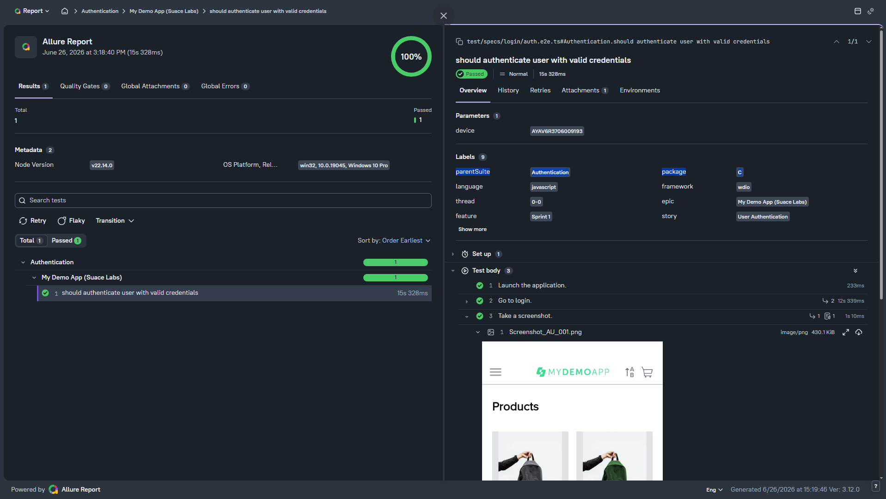

# My Demo App (Sauce Labs) WebdriverIO + Appium Automation

This repository is a demonstration project that replicates the mobile automation framework and project structure I originally designed from scratch. It showcases how the framework is organized and implemented using Appium, WebdriverIO, and supporting tools, serving as a reference for scalable, maintainable, and reusable mobile test automation.

The project includes sample automated tests for the **My Demo App (Sauce Labs)** application, demonstrating core automation concepts such as authentication, user flows, page object modeling, reporting, and CI/CD integration.

### Tools & Frameworks Used

1. **Appium** – Mobile automation framework used to interact with mobile applications on real devices and emulators for both Android and iOS.
2. **UIAutomator2** – Appium's Android automation driver that enables reliable interaction with native Android applications by leveraging Google's UIAutomator2 framework.
3. **Appium Inspector** – A visual tool for exploring mobile app elements, inspecting UI components, and generating locator strategies to support automation script development.
4. **WebdriverIO** – Test automation framework that provides a clean and efficient way to write, organize, and run automated scripts for mobile testing.
5. **Mocha** – Test runner used to structure and execute test cases in a readable, BDD/TDD-style format.
6. **Allure Report 3** – Reporting tool that generates detailed, visual test reports with steps, attachments, and test history to track automation quality.
7. **GitHub Actions** – CI/CD automation used to generate and deploy Allure reports directly to GitHub Pages for easy access and sharing.


## 📱 Application Under Test
**My Demo App (Sauce Labs)**





## Project Structure

```text
wdio-appium-automation/
├── .github/
│   └── workflows/
├── src/
│   ├── assertions/
│   ├── constants/
│   ├── data/
│   ├── flows/
│   ├── metadata/
│   ├── pages/
│   ├── types/
│   └── utils/
├── tests/
│   └── *.spec.ts
├── .env
├── .env.example
├── .gitignore
├── package-lock.json
├── package.json
├── tsconfig.json
├── wdio.conf.ts
└── README.md
```